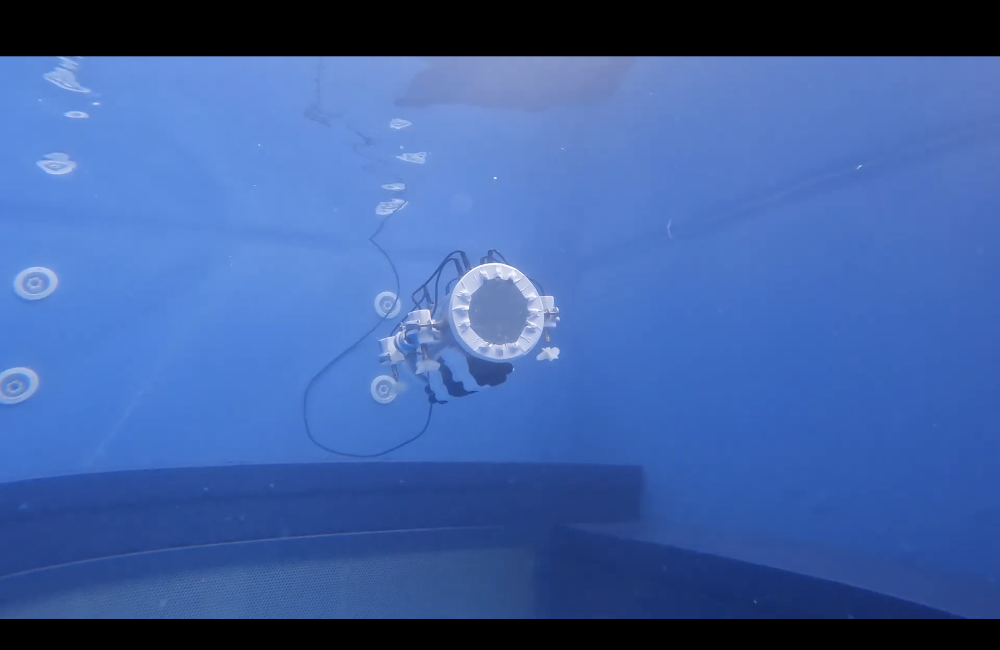
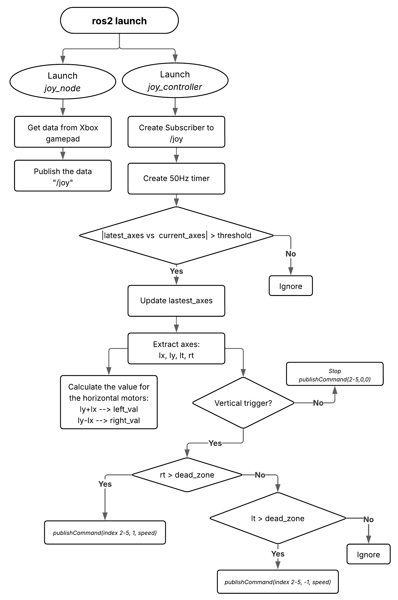

# Aquabotics ROS2 Workspace

This repository contains the ROS2 workspace for **Aquabotics**, our open-source remotely-operated underwater vehicle. It includes all the packages, launch files, and helper scripts you need to:

- Read input from an Xbox gamepad  
- Run a joystick‐to‐motor command node  
- Visualize and extend the control logic  



---

## 📂 Repository Structure

```
aquabotics_ws/
├── README.md
├── images/
│ └── joy_controller_flowchart.png
├── launch/
│ └── aquabotics.launch.py
├── src/
│ ├── joy_node/
│ │ ├── package.xml
│ │ ├── CMakeLists.txt
│ │ └── src/joy_node.cpp
│ └── joy_controller/
│ ├── package.xml
│ ├── CMakeLists.txt
│ └── src/joy_controller.cpp
└── workspace.yaml # (optional) colcon workspace config
```

- **launch/**  
  Contains the main ROS2 launch file which brings up both the `joy_node` and the `joy_controller` nodes in one command.

- **src/joy_node**  
  A simple node that reads raw axes and button data from an Xbox gamepad (via `joy_linux` or `joy`), and publishes it on the `/joy` topic.

- **src/joy_controller**  
  Subscribes to `/joy`, applies dead-zone and change-threshold logic, and computes high-level motor commands which it then publishes to your vehicle’s motor driver interface.

---

## 🚀 Prerequisites

- Ubuntu 22.04  
- ROS2 Humble
- `joy` package installed (`sudo apt install ros-<distro>-joy`)

---

## ⚙️ Installation & Build

1. Clone this repo into your ROS 2 workspace:
   ```bash
   cd ~/ros2_ws/src
   git clone https://github.com/richy-gs/aquabotics_ws.git
   ```
3. Install dependencies:
  ```bash
  cd ~/ros2_ws
  rosdep install --from-paths src --ignore-src -r -y
  ```
3. Build with colcon:
  ```
  colcon build --symlink-install
  ```
4. Source the install overlay:
  ```
  source install/setup.bash
  ```

---

## ▶️ Running

Bring up both nodes in one go:
  ```bash
  ros2 launch aquabotics launch/aquabotics.launch.py
  ```

This will:
1. Launch `joy_node` to read your Xbox controller.
2. Launch `joy_controller` to process `/joy` and publish motor commands.

---

## 📈 Main Workflow Diagram


__*Figure: Flowchart of the joystick control logic.*__

1. ros2 launch brings up both nodes.
2. `joy_node` reads Xbox gamepad data and publishes to `/joy`.
3. `joy_controller` sets up a 50 Hz timer, ignores small joystick changes (`threshold`), extracts the four axes (`lx`, `ly`, `lt`, `rt`), computes left/right horizontal motor values, checks the vertical triggers (`lt`/`rt`) against a dead-zone, and publishes the appropriate motor commands—otherwise it stops or ignores no-ops.


